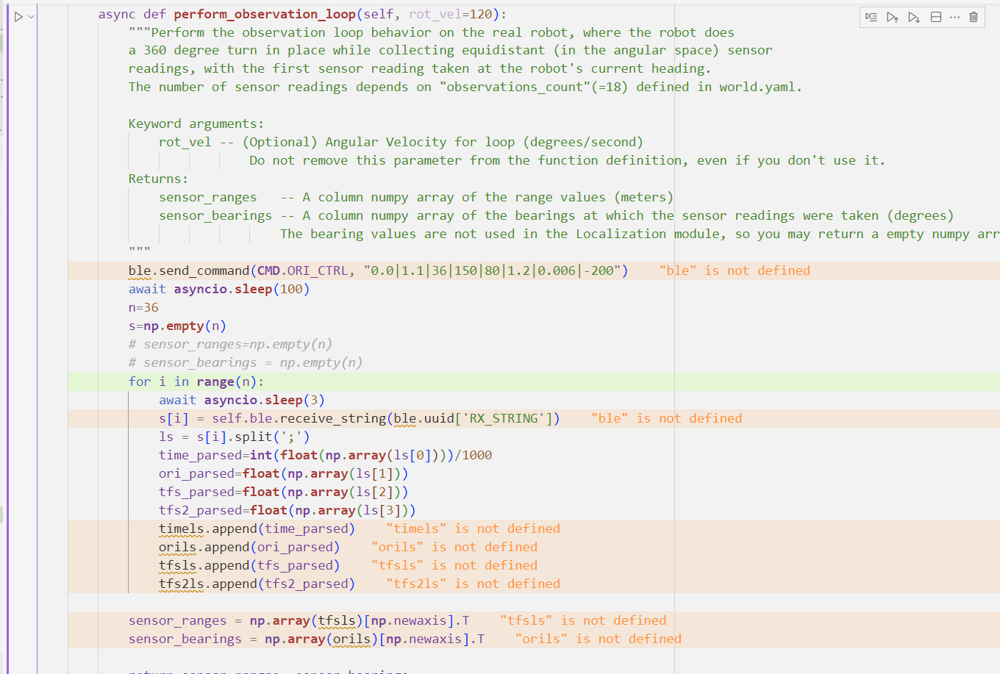
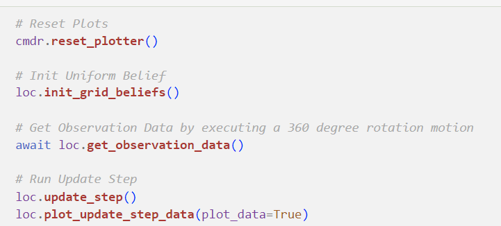
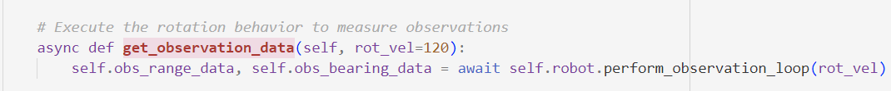

# Lab 11: Localization

## Overview
* Goal: Find out the current location of car using the readings from Time-Of-Flight sensor, accelerometer, and gyroscope. 
* Highlevel:
  1. Start from the initial point, rotate and read the TOF readings to get the information of the environment nearby(the same as what I did in Lab9)
  2. Use the data from TOF and DMP to compute the probability that the car is in each of the grid. 
  3. Apply the Bayes Fitler to get the final probabilty.
  4. consider the grid with the highest probability as the current location. 
* Implementation:
  * Send command to let the car rotate in place, get the TOF readings like the Lab9. Still, read TOF data every 10 degree. This is higher than the requirement specified in handout, it brings higher accuracy. 
  * Save them in ndarray for later use. 
  * 
  * Add the syncio to achieve synchronous:
  * 
  * 
## Chanllenges
* Synchronization
  * Figure how to use the "async" and "await" with the correct syntax can be tricky. 
  * Using "asyncio.run(asyncio.sleep(3))" can bypass the issue, but this is not the suggested way, and causes some unexpected behavior. 
