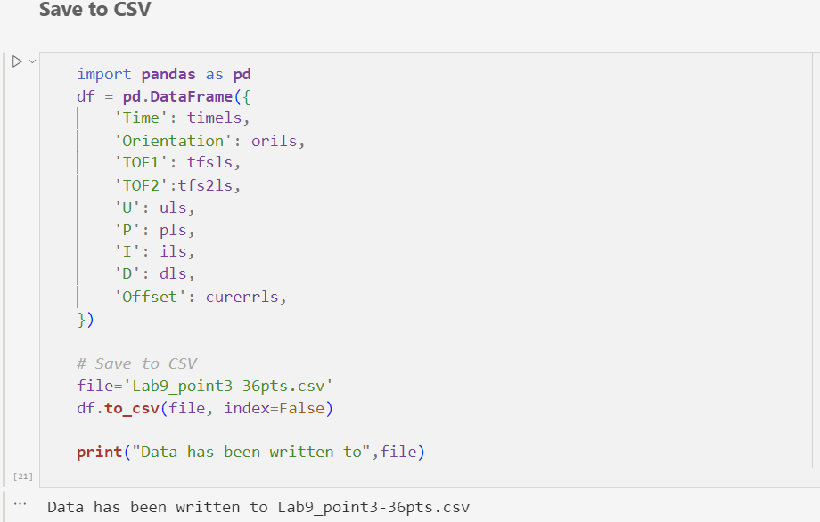
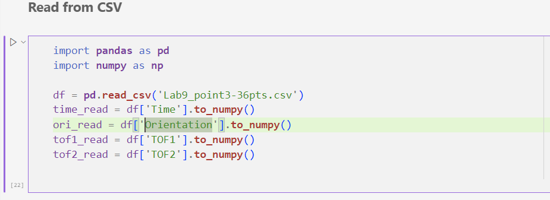
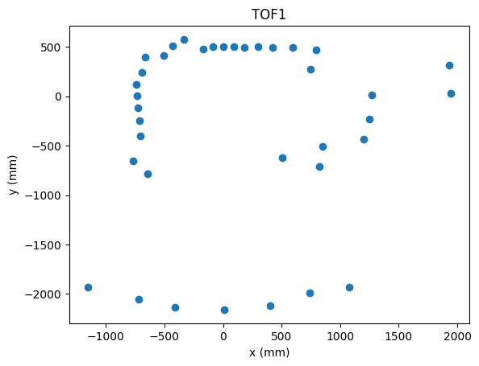

# Lab 9 mapping
## Overview
* Goal: Sensing the environment nearby. 
* Highlevel: 
    1. Rotate the car in place and measure the distance with Time-Of-Flight sensor during the rotation. 
    2. Put the orientation and the tof readings in polar coordination, and then convert them into Cartesian coordination. 
    3. Repeat the step1&2 in several different location and combine them together to get the map of the room. 
* Technical Approach(Pseudocode): 
```
num_reading=0;
if (current orientaion is close to set orientaion){
    u=0;
    if (num_reading<num_ori_rotation){
        tof sensing;
        num_reading+=1;
        Setori+=rotate_degree
        calibrate Setori to within (-180,180]
    }else{
        allowrun=false;
    }
}
else
    continue on current rotation
```

## Data collection and saving
* Point1:
* <iframe width="630" height="470" src="https://youtu.be/jm7cUhabQ3s" allow="autoplay; encrypted-media"></iframe> 

* Point2:
* <iframe width="630" height="470" src="https://youtu.be/iW6pX8hRw8c"></iframe>   

* Point3:
* <iframe width="630" height="470" src="https://youtu.be/n5eeKJdSeoM" allow="autoplay; encrypted-media" allowfullscreen></iframe>  

* Point4:
* <iframe width="630" height="470" src="https://youtu.be/bpoCBWbaYEk" allow="autoplay; encrypted-media" allowfullscreen></iframe>  


* Then, I used the following python code to save the readings to csv files:
* 
* And read from the saved csv with:
* 
* Next, apply the translation matrix:
* 
* Last, draw it out:
* 

## Chanllenges
1. Tunning PID values
   * tunning the PID values has been done in lab6; however, after I used a new battery, the voltage changed from 3.67v to 4.18v, and I have to retune the PID values. 
2. Time-Of-Flight sensor 2 doesn't work
   * Due to unknown reason, the readings from Time-Of-Flight sensor 2 is only the half of that of TOF 1, and it's not reflecting the room's shape at all. To resolve this, I decide to discard the readings from TOF2, and get more data from TOF1; This is the reason why I choose read TOF every 10 degree to get 36 readings every cycle instead of the 20 degree in the handout. 


## Showcase
* Point1:
* 

* Point2:
* 

* Point3:
*   

* Point4:
*   

